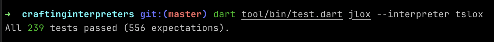

# talox

Typescript implementation of a tree-walk interpreter for the Lox programming language.

What is lox? https://craftinginterpreters.com/the-lox-language.html
What is a tree-walk interpreter? https://craftinginterpreters.com/a-tree-walk-interpreter.html

## Usage

Install dependencies using npm/yarn:

```bash
npm i
```

Then run the interpreter:

```bash
# Run in REPL mode.
npm start

# Or parse an entire file.
npm start samples/helloWorld.lox
```

If you want the interpreter to be available as a command-line app:

```bash
# Generate the source files.
npm install
npm run build

# Then link this repo.
npm link

# Then you can use the command.
tslox
tslox myFile.lox
```

## Standards Compliance

This interpreter currently passes all of the dart tests present in [craftinginterpreters](https://github.com/munificent/craftinginterpreters) repo. If you want to check for yourself, follow the steps below:

1. Clone the [munificent/craftinginterpreters](https://github.com/munificent/craftinginterpreters) repo.
2. Install its dependencies (dart) and follow its instructions in order to run the tests.
3. Once you can run tests, just use the command below:

```
dart tool/bin/test.dart jlox --interpreter tslox
```


